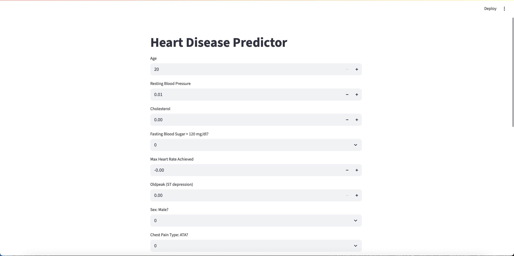
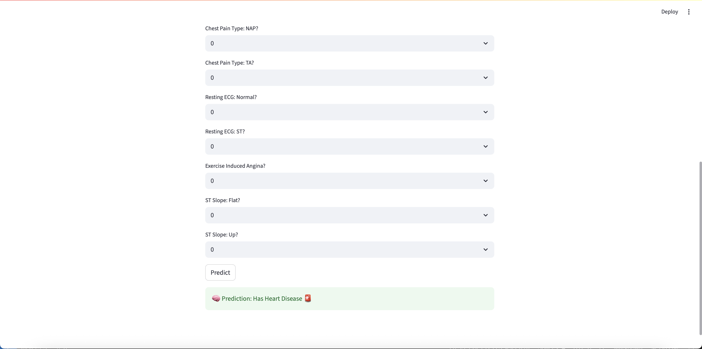

# Week 7: Machine Learning Model Deployment with Streamlit

This project demonstrates the deployment of a machine learning model using **Streamlit**. I have trained a Random Forest Classifier on the **Heart Disease** dataset and created an interactive UI using Streamlit to make predictions based on user input.

---

## 🔧 Technologies Used

- Python
- Pandas, NumPy, Scikit-learn
- Streamlit
- Pickle (for model serialization)

---

## 🚀 Running the App

1. Clone the repository or navigate to the folder:

```bash
cd week7_ML_Model_deployment
```

2. Make sure dependencies are installed:

```bash
pip install -r requirements.txt
# or specifically:
pip install streamlit scikit-learn pandas numpy
```

3. Run the Streamlit app:

```bash
streamlit run app.py
```

4. This will open the app in your browser at `http://localhost:8501`

---

## 🧠 Model Details

I used a **Random Forest Classifier** trained on the following features (after preprocessing):

- Age, RestingBP, Cholesterol, FastingBS, MaxHR, Oldpeak
- Encoded categorical variables: Sex, ChestPainType, RestingECG, ExerciseAngina, ST_Slope

Model was saved using:

```python
import pickle
pickle.dump(model, open('model.pkl', 'wb'))
```

---

## 🖼 UI Preview

Add a screenshot of your deployed app here (name it `screenshot.png`):




---

## ✅ Prediction Logic

The app takes user inputs (age, sex, cholesterol, etc.), prepares the data in the expected format, and returns a prediction: **"Has Heart Disease"** or **"No Heart Disease"**.

